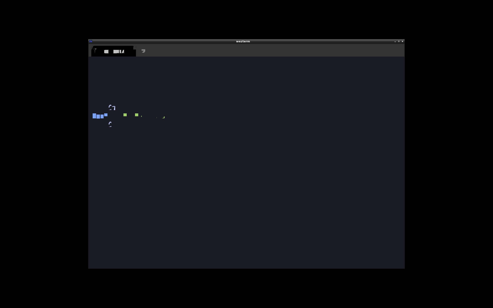

# Y700 Termux X11 데스크탑 환경

Lenovo Legion Y700 2023 태블릿에서 Termux + X11 기반의 리눅스 데스크탑 환경을 구성한 설정 모음입니다.



## 하드웨어

| 항목 | 사양 |
|------|------|
| 기기 | Lenovo Legion Y700 (2023) |
| SoC | Qualcomm Snapdragon 8 Gen 1 |
| GPU | Adreno 730 |
| 디스플레이 | 8.8인치 2560×1600 (~343 PPI) |

## 구성 요소

| 역할 | 소프트웨어 |
|------|-----------|
| X11 서버 | Termux:X11 |
| 윈도우 매니저 | i3wm |
| 터미널 | WezTerm (WebGPU + turnip 하드웨어 가속) |
| 런처 | rofi (Arc-Dark 테마) / dmenu |
| 알림 | dunst |
| 한국어 입력 | fcitx5 |
| 파일 관리 | ranger |
| PDF 뷰어 | mupdf |
| 이미지 뷰어 | feh |
| Linux 환경 | proot-distro (Ubuntu) |

## 주요 특징

### GPU 하드웨어 가속
WezTerm이 Adreno 730을 직접 사용합니다. Android에서 `/dev/kgsl-3d0`는 root 없이 접근 가능하며, Mesa turnip ICD를 통해 Vulkan 하드웨어 가속이 동작합니다.

```
VK_ICD_FILENAMES=.../freedreno_icd.aarch64.json wezterm start
```

기존 LLVMpipe(소프트웨어) 렌더러 사용 시 폰트 아틀라스 깨짐 현상이 있었으나 turnip 전환 후 해결됐습니다.

### HiDPI 대응
X11은 프로토콜 수준의 스케일링이 없어 앱마다 개별 설정이 필요합니다.

- `~/.Xresources`: `Xft.dpi: 192`
- `xrandr --dpi 192` (start-x11.sh에서 적용)
- WezTerm: `font_size = 24.0` (96 DPI 렌더링 기준 2x 보정)
- rofi: `font: "... 21"` (config.rasi)
- dmenu: `pixelsize=32` 플래그

### 한국어 폰트
WezTerm 폰트 폴백 체인:
1. PlemolKRConsole Nerd Font Mono (주 폰트, 반각 기준)
2. Noto Sans CJK KR (한글)
3. Noto Sans Symbols 2 (특수문자)
4. Noto Color Emoji (이모지)
5. Symbols Nerd Font Mono (Nerd Font 아이콘)

> ⚠️ Symbols Nerd Font Mono를 첫 번째에 두면 모든 문자가 전각으로 렌더링됩니다.

### proot Ubuntu
`proot-distro login ubuntu`로 Ubuntu 환경을 사용합니다.
dotfiles는 이 저장소(`y700-term-kr`)를 clone한 뒤 `./install.sh`로 적용합니다.

> ⚠️ oh-my-posh, fzf 등 바이너리는 반드시 **aarch64** 빌드를 사용해야 합니다.
> Termux 네이티브에서는 linker가 non-PIE(EXEC) 바이너리를 거부하므로, `install.sh`가
> `pkg`로 네이티브 PIE 패키지를 설치하고 proot/glibc에서는 aarch64 릴리스를 내려받습니다.

### Claude Code

**proot Ubuntu 안에서만** 설치·실행 가능합니다. Termux 네이티브는 Android Bionic libc를 사용하므로 Claude Code의 Node.js 네이티브 모듈이 동작하지 않습니다.

Termux 자체를 Claude로 제어하려면 **Termux 네이티브에 sshd를 띄워** proot에서 SSH로 우회 진입합니다.

```
[proot] Claude Code  ──ssh termux-native──▶  [Termux] pkg, termux-api, ...
```

설치·인증 절차는 `INSTALL.md` 7단계 참조.

## 단축키

`i3-keybindings.md` 참고.

## 팁

### 두 손가락 스크롤

Termux:X11 기본 포인터 모드에서는 두 손가락 스크롤이 동작하지 않습니다.
Termux:X11 설정 → **Pointer** → **Simulated touchscreen** 모드로 전환하면 두 손가락 스크롤이 활성화됩니다.

### URL 클릭 → Android 브라우저

proot 안 WezTerm에서 URL을 Ctrl+Click 하면 `xdg-open`을 통해 Android 기본 브라우저가 열립니다.
(`install.sh` 적용 시 `~/.local/bin/xdg-open` 자동 설치)

### Shift+Enter (WezTerm)

Claude Code 등 일부 TUI 앱은 Enter와 Shift+Enter를 구분합니다(Shift+Enter = 줄바꿈, Enter = 전송).
WezTerm은 기본적으로 둘을 동일한 `\r`로 전송하므로, `wezterm.lua`에서 kitty keyboard protocol 시퀀스를 명시적으로 매핑합니다.

```lua
config.keys = {
  {
    key = "Return",
    mods = "SHIFT",
    action = wezterm.action.SendString("\x1b[13;2u"),
  },
}
```

i3wm에서는 Shift+Return이 기본적으로 **새 터미널 열기** 단축키(`bindsym $mod+Shift+Return exec wezterm`)로 쓰이므로 WezTerm 내부 키바인딩이 i3에 가로채이지 않도록 WezTerm 창에 포커스가 있을 때만 동작합니다. WezTerm이 포커스를 갖고 있으면 키 이벤트를 먼저 처리하므로 i3로 전달되지 않습니다.
